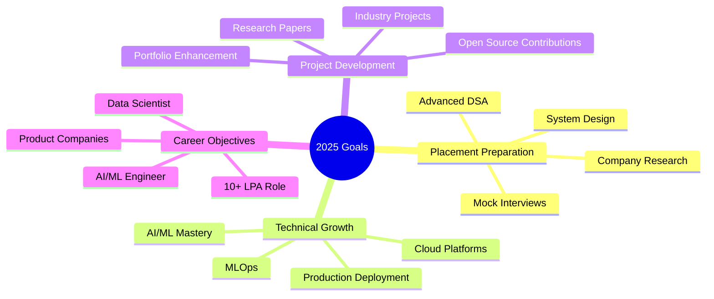

# Hi there! 👋 I'm **Vaibhav Parabhane**

<div align="center">
  
  [](https://git.io/typing-svg)
  
  🚀 **AI & Data Science Enthusiast** | 💡 **Problem Solver** | 🔥 **Innovator**
  
  📍 **AISSMS IOIT, Pune** | 🎯 **2025 Placement Ready** | 💼 **10 LPA+ Target**
  
  [](https://linkedin.com/in/vaibhavparabhane)
  [](https://github.com/vaibhavparabhane)
  [](mailto:vaibhav.parabhane@example.com)
  
</div>

---

## 🌟 About Me

```python
class VaibhavParabhane:
    def __init__(self):
        self.name = "Vaibhav Parabhane"
        self.role = "Final Year B.Tech Student"
        self.specialization = "Artificial Intelligence & Data Science"
        self.location = "Pune, Maharashtra"
        self.current_focus = [
            "Advanced DSA & System Design",
            "AI/ML Project Development", 
            "2025 Placement Preparation",
            "Building Intelligent Solutions"
        ]
        self.goal = "Secure challenging AI/ML or Data Engineering role"
    
    def say_hello(self):
        return "Thanks for visiting! Let's build something amazing together! 🚀"

me = VaibhavParabhane()
print(me.say_hello())
```

---

## 🛠️ Tech Stack & Skills

<div align="center">

### 💻 Programming Languages


### 🤖 AI/ML & Data Science


### 📊 Data & Visualization


### 🔧 Tools & Platforms


</div>

---

## 🔥 Current Projects

<div align="center">

| Project | Description | Tech Stack | Status |
|---------|-------------|------------|---------|
| 🗺️ **AI Trip Planner** | Intelligent travel planning with personalized recommendations | Python, OpenAI, Streamlit | 🚧 In Progress |
| 🤖 **EduBot** | AI-powered educational chat assistant | LangChain, NLP, Python | ✅ Completed |
| 📧 **Spam Classifier** | Email spam detection using ML algorithms | Python, Scikit-learn, NLP | ✅ Completed |
| 🏏 **IPL Performance Predictor** | Cricket performance analytics and prediction | Python, ML, Data Analysis | ✅ Completed |

</div>

---

## 📈 GitHub Statistics

<div align="center">
  
  
  
  
  
  
  
</div>

---

## 🏆 Achievements & Experience

<div align="center">

### 🥉 Hackathons & Competitions
```
🥈 2nd Place - National Level Hackathon
🏆 Multiple coding competition participations
📈 Consistent problem-solving track record
```

### 💼 Professional Experience
```
🔹 Infosys Springboard Intern
   └── IPL Prediction Model Development
   
🔹 Edunet Foundation Intern  
   └── Spam Classifier & EduBot Development
   
🔹 AI Student Association Administrator
   └── Leading AI initiatives & community building
```

</div>

---

## 📊 Coding Activity

<div align="center">
  
  [](https://github.com/ashutosh00710/github-readme-activity-graph)
  
</div>

---

## 🎯 2025 Goals & Focus Areas

<div align="center">



</div>

---

## 💡 Fun Facts

<div align="center">

🎮 **When I'm not coding, you'll find me:**
- 🧠 Solving algorithmic puzzles on LeetCode
- 📚 Reading about latest AI research papers
- 🏏 Analyzing cricket statistics (hence the IPL predictor!)
- 🎵 Listening to lo-fi music while debugging
- 🌱 Learning new technologies and frameworks

**Random Dev Fact:** I can debug Python code faster with music on! 🎧

</div>

---

## 🤝 Let's Connect!

<div align="center">

**Open to:** Internships | Full-time Roles | Collaborative Projects | Mentorship

```
📧 Email: vaibhav.parabhane@example.com
💼 LinkedIn: linkedin.com/in/vaibhavparabhane  
🐱 GitHub: github.com/vaibhavparabhane
📱 Phone: +91-XXXXXXXXXX
```

### 💬 Want to collaborate or just say hi?

[](mailto:vaibhav.parabhane@example.com)

---

<div align="center">
  
  **⭐ Star my repositories if you find them interesting!**
  
  
  
  ---
  
  *"Building the future, one algorithm at a time"* 🚀
  
</div>

</div>
